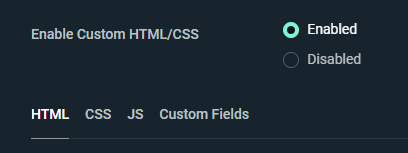
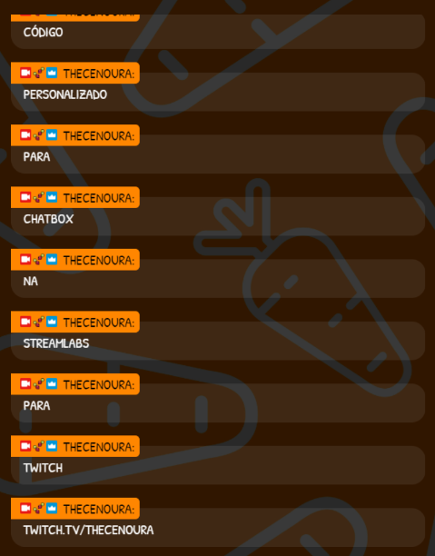

# chatbox-streamlabs
### Chat box customizado para Twitch no StreamLabs

Para acessar as configurações do Chat Box no streamlabs é pelo menu <i>Stream Essentials</i> > <i>All widgets</i> > <i>Chat Box</i>. 

No documento 'more_settings.txt' neste projeto, estão as configurações que utilizo, caso queira tomar como referência.  

A inserção do código personalizado só será liberada se você permitir, como na imagem abaixo.  
</img>

Ali deverão ser inseridos os códigos disponíveis nos seguintes arquivos:
<ul>
    <li>html.html</li>
    <li>css.css</li>
    <li>js.js</li>
</ul>
E por fim você pode mais configurações no <i>Custom Fiels</i>.   

Exemplo do chat box abaixo:  
</img>   

### Já aproveita e segue lá na twitch: <a href="https://www.twitch.tv/thecenoura">thecenoura</a> </img>